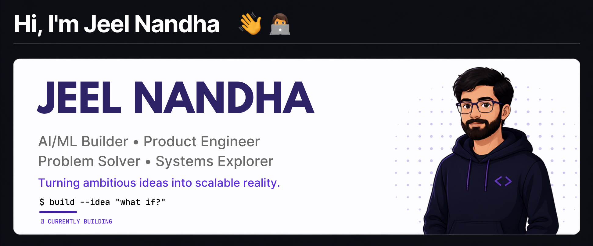

<p align="center">
  
</p>

## 🧠 About Me

I'm an **AI/ML student, builder, and problem solver** who enjoys taking ideas from a rough *"what if?"* to something that actually runs, ships, breaks, gets rebuilt, and eventually works the way it was supposed to.

I don't just want to **learn technologies**.

**I want to build with them.**

---

## ⚡ My Build Loop

```text
WHAT IF?  →  BUILD IT  →  BREAK IT  →  FIGURE IT OUT
   ↑                                             ↓
   └──────  MAKE IT BETTER  ←  SHIP IT  ─────────┘
```

> **Curiosity starts it. Building proves it. Iteration makes it real.**

```

I don't believe you need to know everything before starting.

Sometimes the fastest way to understand something is to **build the wrong version first.**

---

## 🚀 Currently

🔭 **Building** — AI/ML products, intelligent systems, automation, AI agents, full-stack applications, and experiments that live somewhere between *"what if?"* and *"wait... this actually works."*

🧠 **Sharpening** — Data Structures & Algorithms, Machine Learning, Deep Learning, Generative AI, Cloud Computing, and the engineering required to take an idea beyond a prototype.

🏗️ **Exploring** — Production-grade AI systems, scalable architectures, developer tools, APIs, real-time systems, and the space where software engineering meets intelligent systems.

🏆 **Competing** — Hackathons, where the clock is running, the problem is never as simple as it looked, and somehow the goal is still to ship something worth remembering.

🎯 **Next target** — Become dangerously good at solving problems, building systems, and turning ambitious ideas into things people can actually use.

---

## 🧠 What You'll Find Around Here

### 🤖 AI / Machine Learning

Models, experiments, computer vision, ML pipelines, AI-powered applications, intelligent automation, and whatever interesting AI rabbit hole I'm currently exploring.

### 🧩 Data Structures & Algorithms

A growing collection of problems, patterns, approaches, optimizations, and the occasional battle against a problem that looked *way* easier than it actually was.

### 🏗️ Product Engineering

Full-stack applications, APIs, authentication, databases, dashboards, real-time systems, deployments, and the infrastructure that turns an idea into something usable.

### ⚔️ Hackathons

Fast builds. Faster debugging. Teamwork under pressure.

Most importantly — **shipping something instead of just talking about it.**

### 🧪 Experiments

Some projects are meant to become products.

Some are meant to answer a question.

Some exist because I thought:

> *"Can I actually build this?"*

Those projects belong here too.

---

## 🛠️ Tech Stack

                                                                                        

---

## 🌐 Socials

[](https://discord.gg/https://discord.gg/syRADezbM)
[](https://instagram.com/jeel__nandha)
[](https://linkedin.com/in/jeelnandha)
[](mailto:jeelverse@outlook.com)

---

## 📊 GitHub Stats

<br/>
<br/>


---

### ✍️ Random Dev Quote


---

## ⚡ One Last Thing

I don't want this profile to be a list of technologies.

I want it to be a **trail of things I've built, problems I've solved, experiments I've survived, and ideas I've refused to leave as ideas.**

> **Ideas are cheap. Repositories are evidence.**

<p align="center">
  <b>Keep building. Keep breaking. Keep shipping. ⚡</b>
</p>
